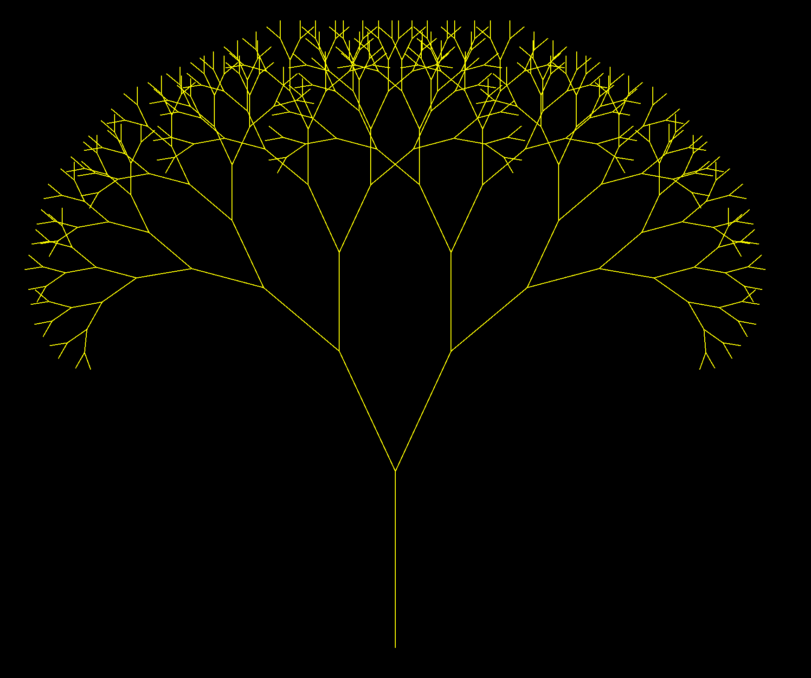
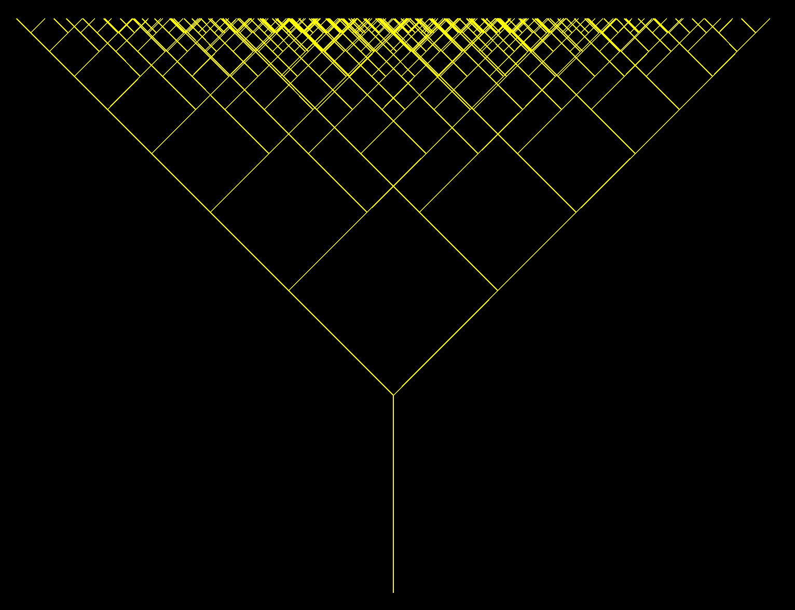

Unit 8: Recursion, Sorts, Searches
===========================

*Standard 8 - Understand, analyze, and create recursive, sorting, and searching algorithms*

Fractal Tree Lab

# Introduction

The goal of this lab is to create a recursive algorithm to draw a tree.

Imagine you were describing how to draw a tree. You might say:

1. Draw a vertical line

2. At the top of the line, draw two smaller lines ("branches") in a v shape

3. At the ends of each of those two branches, draw two even smaller branches

4. Keep repeating the process, drawing smaller and smaller branches until the branches are too small to draw

This process of repeating the same design at a continually decreasing scale is an example of a *Fractal*. Using fractals to draw trees can give some interesting and beautiful patterns[.](http://www.visualbots.com/tree_project.htm) In this assignment we will use a recursive branching function to create a fractal tree.

# Requirements

* Commit to GitHub, at least daily, with a meaningful commit message describing what you accomplished and what needs to be done next.

* Use the Koch Snowflake program as a starting point for an TreeViewer class and a TreeComponent class. A BlueJ version of the program is in the Koch folder in your repository. There is also a [repl.it version](https://repl.it/@gcschmit/KochSnowflake) available that you can fork. 

* The Math class has a lot of helpful methods:

    * Math.sin(), Math.cos()

    * Math.toRadians()

* The trunk of the tree may be drawn explicitly in the paintComponent method or in the recursive method. Either is fine.

* We will have three member variables that will control:

    * how much smaller the branches are

    * how small the branches will get

    * the angle between the branches.

* You determine what parameters are needed for the recursive method. There are more than one combination of parameters that will work.

* The angle of the fractal tree branches changes for subsequent branches. A picture communicates this requirement better. This is a tree with **correct** branching:

This is a tree with **incorrect** branching:

* Demonstrate your program to your instructor for feedback before submitting.

# Extensions

* Add controls (e.g., sliders) to allow the user to change member variables that affect the construction of the tree.

* Some fantastic trees can be produced by modify algorithm to add asymmetry, adjust angles, adjust thickness, or adjust color.

* Add a creative effect for the terminating condition.

* Add More Awesome.

# Submission

* Submit a link to your GitHub repository with this assignment.

* If you would like your Fractal Tree Lab featured on the school TVs, take a screenshot of your image and add it to the [shared Google slide deck](https://docs.google.com/presentation/d/1OU64chkZ5VRBbZRIc8WjYoYW97OgAXkv77EMaNimjiQ/edit?usp=sharing) based on the provided template slide.

